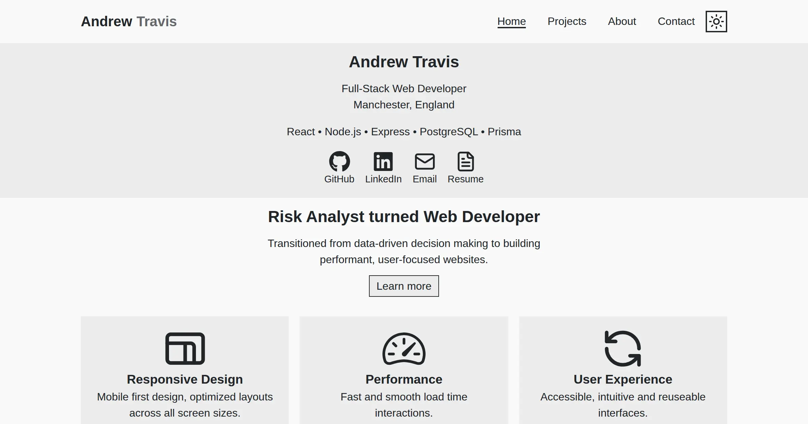

# Portfolio - Client Side

Portfolio of Andrew Travis - Full stack web developer specializing in React and Node.js based web applications.

## About

This is the client side of a full stack web application showcasing my portfolio projects while expanding and solidifying my understanding of responsive design, user accessibility, code reusability, and creativity.

## Features
* Responsive UI built with React and Styled Components
* Persistent theme selection saved using Local Storage
* Contact form submission via a separate Nodemailer backend service

## Tech Stack
* **Front End:** HTML, CSS, JavaScript, React, Styled-Components, Vite
* **Other Tools:** VSCode, Prettier, ESLint

*(Back end service for email handling lives in a separate repository: [portfolio-server](https://github.com/AndrewAttemptsCode/portfolio-server))*

## Screenshot


## Prerequisites

> Note: This project relies on a separate backend service for handling contact form submissions via Nodemailer.  
> Please clone and run the backend server from [this repository](https://github.com/AndrewAttemptsCode/portfolio-server) before using the contact form.

Make sure you have the following installed:

* [Node.js](https://nodejs.org/en) (v18 or later)

* [Email server back end](https://github.com/AndrewAttemptsCode/portfolio-server) - Required for sending emails via Nodemailer


## Installation
```bash
# Clone the repo
git clone https://github.com/AndrewAttemptsCode/portfolio-client.git

# Navigate into the folder
cd project-name

# Install dependencies
npm install
```

## Environment Variables
Create a .env file within the root folder and add:
```
VITE_SERVER_URL=YOUR_SERVER_URL
```
Replace `YOUR_SERVER_URL` with the actual URL of your backend server.

## Running the app
```bash
# Start the development server
npm run dev
```